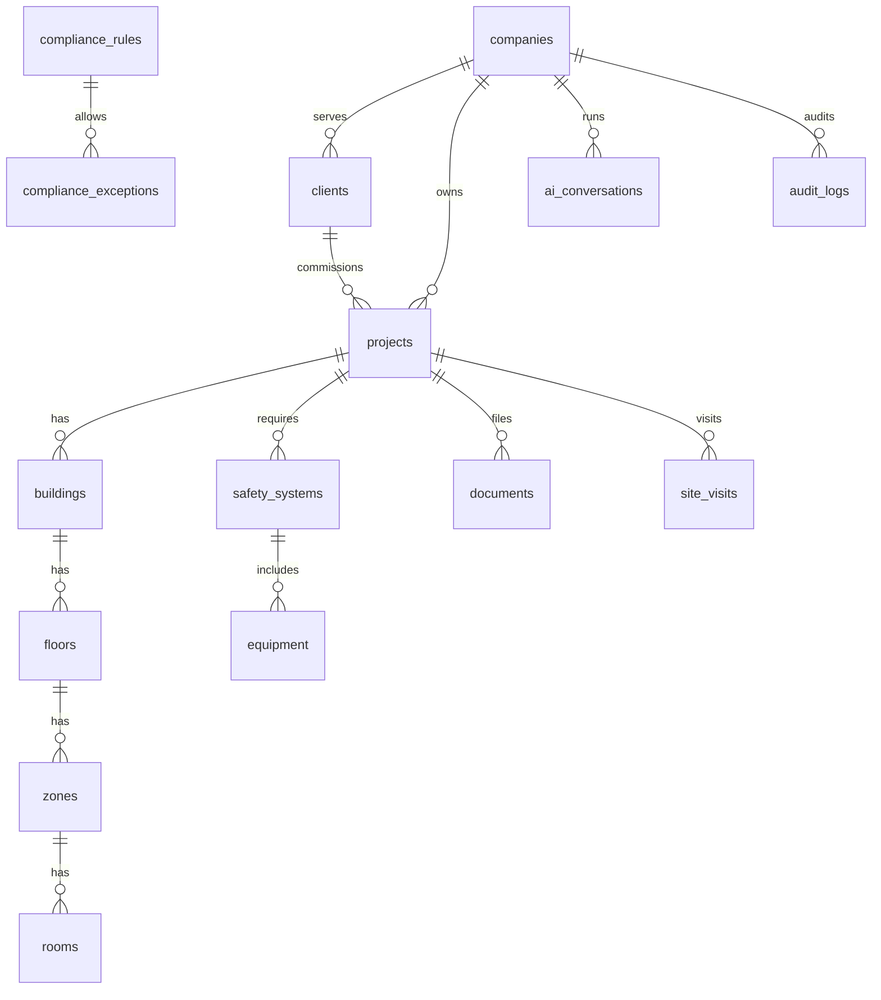
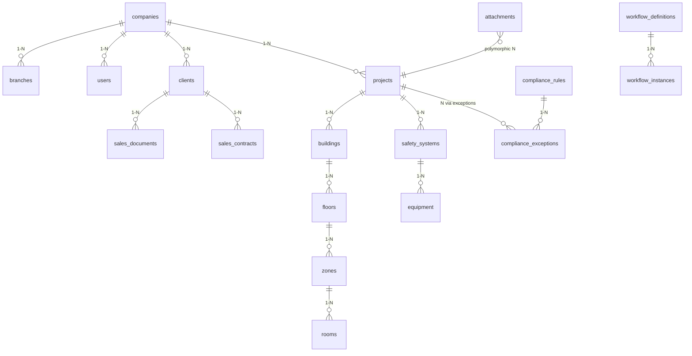
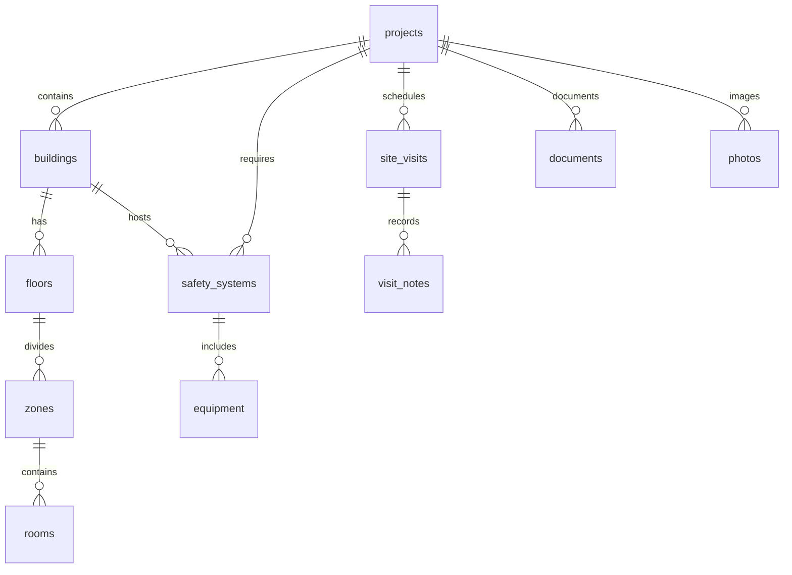

# وثيقة تصميم قاعدة البيانات (DDS) — منصة توقع

| البند | القيمة |
|--------|--------|
| المنصة | منصة توقع لاستشارات السلامة والوقاية من الحريق |
| نوع الوثيقة | Database Design Specification (DDS) |
| الإصدار | 1.0 |
| التاريخ | 2026-07-26 |
| الحالة | معتمد للمرحلة الأولى |
| محرك قاعدة البيانات | PostgreSQL عبر Supabase |
| المصدر الوحيد للحقيقة | مخطط `public` في PostgreSQL |

---

## الفهرس

1. [الباب الأول: مقدمة](#الباب-الأول-مقدمة)
2. [الباب الثاني: معمارية قاعدة البيانات](#الباب-الثاني-معمارية-قاعدة-البيانات)
3. [الباب الثالث: نموذج البيانات الرئيسي](#الباب-الثالث-نموذج-البيانات-الرئيسي)
4. [الباب الرابع: تصميم الجداول](#الباب-الرابع-تصميم-الجداول)
5. [الباب الخامس: العلاقات](#الباب-الخامس-العلاقات)
6. [الباب السادس: هيكل المشروع](#الباب-السادس-هيكل-المشروع)
7. [الباب السابع: إدارة الوثائق](#الباب-السابع-إدارة-الوثائق)
8. [الباب الثامن: إدارة المرفقات](#الباب-الثامن-إدارة-المرفقات)
9. [الباب التاسع: إدارة الصور](#الباب-التاسع-إدارة-الصور)
10. [الباب العاشر: محرك الامتثال](#الباب-العاشر-محرك-الامتثال)
11. [الباب الحادي عشر: محرك المعرفة](#الباب-الحادي-عشر-محرك-المعرفة)
12. [الباب الثاني عشر: قاعدة بيانات الذكاء الاصطناعي](#الباب-الثاني-عشر-قاعدة-بيانات-الذكاء-الاصطناعي)
13. [الباب الثالث عشر: إدارة الإصدارات](#الباب-الثالث-عشر-إدارة-الإصدارات)
14. [الباب الرابع عشر: سجل العمليات (Audit)](#الباب-الرابع-عشر-سجل-العمليات-audit)
15. [الباب الخامس عشر: إدارة الأرشيف](#الباب-الخامس-عشر-إدارة-الأرشيف)
16. [الباب السادس عشر: الأداء](#الباب-السادس-عشر-الأداء)
17. [الباب السابع عشر: الأمن](#الباب-السابع-عشر-الأمن)
18. [الباب الثامن عشر: التعافي من الكوارث](#الباب-الثامن-عشر-التعافي-من-الكوارث)
19. [الباب التاسع عشر: جودة البيانات](#الباب-التاسع-عشر-جودة-البيانات)
20. [الباب العشرون: قاموس البيانات](#الباب-العشرون-قاموس-البيانات)
21. [الباب الحادي والعشرون: إدارة البيانات الرئيسية (MDM)](#الباب-الحادي-والعشرون-إدارة-البيانات-الرئيسية-mdm)
22. [الباب الثاني والعشرون: نموذج بيانات سير العمل](#الباب-الثاني-والعشرون-نموذج-بيانات-سير-العمل)
23. [الباب الثالث والعشرون: تعدد المستأجرين](#الباب-الثالث-والعشرون-تعدد-المستأجرين)
24. [الباب الرابع والعشرون: نموذج بيانات التكامل](#الباب-الرابع-والعشرون-نموذج-بيانات-التكامل)
- [ملحق أ: تطبيق المخطط](#ملحق-أ-تطبيق-المخطط)
- [ملحق ب: التوافق مع التطبيق الحالي](#ملحق-ب-التوافق-مع-التطبيق-الحالي)

مخططات إضافية: [diagrams/erd.md](./diagrams/erd.md) · قاموس الحقول: [data-dictionary.md](./data-dictionary.md)

---

## الباب الأول: مقدمة

### 1.1 الهدف — Single Source of Truth

تهدف هذه الوثيقة إلى تعريف **مصدر وحيد للحقيقة (Single Source of Truth)** لبيانات منصة توقع. كل كيان تشغيلي — عميلاً كان أو مشروعاً أو وثيقة أو قيد محاسبي أو قاعدة امتثال — يُمثَّل بسجل واحد في PostgreSQL، وتُشتق منه واجهات Next.js والتقارير والتكاملات دون نسخ متعارضة.

المبادئ العملية للمصدر الوحيد:

- الكتابة تتم عبر جداول `public` المعرّفة هنا أو عبر دوال/سياسات RLS فوقها.
- لا تُعامل ذاكرة المتصفح أو ملفات التصدير أو سجلات الذكاء الاصطناعي كمصدر أساسي للحالة التشغيلية.
- الحقول المشتقة (مثل `pipeline_stage`) تُخزَّن للفلترة والعرض مع بقاء قواعد الاشتقاق موثّقة في طبقة الأعمال.

### 1.2 نطاق الوثيقة

تشمل الوثيقة:

- المعمارية، الجداول، العلاقات، الفهارس، الأمن، الأرشفة، والأداء للمرحلة الأولى.
- الجداول التشغيلية القائمة (`clients`, `sales_*`, المحاسبة) والجداول المضافة (المستأجر، هيكل المشروع، الوثائق، الامتثال، المعرفة، الذكاء الاصطناعي، التدقيق، Workflow، التكامل).
- قاموس البيانات ومخططات ERD المرافقة.

خارج النطاق المباشر لهذه النسخة: تصميم واجهات المستخدم التفصيلي، عقود API REST الكاملة، وترحيل البيانات التاريخية خارج Supabase.

### 1.3 فلسفة التصميم

| المبدأ | التطبيق |
|--------|---------|
| التطبيع (Normalization) | علاقات 3NF للكيانات الأساسية؛ استخدام `jsonb` للحقول المرنة فقط (قوائم تفتيش، مواصفات معدات، أجسام قواعد). |
| عزل المستأجر | عمود `company_id` على الجداول التشغيلية + سياسات RLS. |
| الحذف الناعم | `deleted_at`؛ الاستعلامات الافتراضية تستبعد المحذوف. |
| القابلية للتدقيق | `created_by` / `updated_by` / `version_no` + جدول `audit_logs` و`record_versions`. |
| المصطلحات العربية للأعمال | حالات وحقول العرض بالعربية (`مسودة`, `معتمد`, `بانتظار الدفعة`) مع أكواد تقنية إنجليزية حيث يلزم (`pipeline_stage`, `system_category`). |

### 1.4 المراجع

1. **Supabase / PostgreSQL** — محرك التخزين، Auth، Storage، وRow Level Security.
2. **جداول التطبيق الحالي** — `clients`, `client_follow_ups`, `sales_documents`, `sales_contracts`, `sales_returns`, `chart_of_accounts`, `cost_centers`, `journal_entries`, `journal_entry_lines`, `vouchers` (وامتداد `payments`).
3. **مجال السلامة من الحريق في المملكة** — أنشطة الإشغال، أنواع المباني، أنظمة الإطفاء والإنذار والتهوية والإخلاء، ومتطلبات التراخيص والاستشارات الهندسية.
4. **سكربتات التنفيذ** — `scripts/sql/000` … `007` و`scripts/apply-dds-schema.mjs`.

### 1.5 المصطلحات

| المصطلح | التعريف |
|---------|---------|
| المستأجر (Tenant) | شركة استشارات مسجّلة في `companies` وتعزل بياناتها عبر `company_id`. |
| المسار (Pipeline) | دورة العميل: تسويق → مبيعات → مالية → مشاريع → مكتمل. |
| هيكل المشروع | تسلسل مشروع → مبنى → طابق → منطقة → غرفة → أنظمة → معدات. |
| قاعدة امتثال | شرط مرجعي مرتبط بنشاط/نوع مبنى/نظام سلامة. |
| حذف ناعم | وسم السجل بـ `deleted_at` دون حذف فيزيائي فوري. |
| MDM | إدارة البيانات الرئيسية المرجعية (`ref_*`). |
| RLS | Row Level Security في PostgreSQL. |

---

## الباب الثاني: معمارية قاعدة البيانات

### 2.1 المنصة

- **المحرك:** PostgreSQL 15+ عبر **Supabase** (سحابي).
- **الامتدادات:** `pgcrypto` لتوليد UUID.
- **التخزين الملفات:** Supabase Storage (حاويات مثل `attachments`) مع بيانات وصفية في `attachments` / `photos`.
- **المصادقة:** Supabase Auth؛ يُربط المستخدم التشغيلي عبر `users.auth_user_id`.

### 2.2 التوسع والنسخ الاحتياطي والتشفير

| الجانب | الاستراتيجية |
|--------|----------------|
| التوسع | فهارس جزئية على السجلات النشطة؛ تقسيم مستقبلي للجداول الزمنية الكبيرة (`audit_logs`, `ai_model_usage_log`, `integration_sync_logs`). |
| النسخ الاحتياطي | نسخ Supabase اليومية + تصدير منطقي دوري للجداول الحرجة. |
| التشفير | TLS أثناء النقل؛ تشفير القرص عند الراحة؛ ملفات حساسة عبر مسارات Storage محمية وسياسات وصول. |
| التكرار | النسخ الجغرافي الاختياري لمشاريع الإنتاج (انظر الباب 18). |

### 2.3 الفهارس والتقسيم

- فهارس على `company_id`، مفاتيح العلاقات، و`pipeline_stage`، و`(entity_type, entity_id)`.
- مرشحون للتقسيم حسب المدى الزمني: سجلات التدقيق، استخدام النماذج، سجلات المزامنة.
- تجنّب فهارس زائدة على أعمدة منخفضة الانتقائية مثل الحالات ذات القيم القليلة دون مركّب مع `company_id`.

### 2.4 الطبقات

```
Next.js App  →  Supabase Client / Service Role  →  PostgreSQL (public)
                                              ↘  Storage (ملفات)
```

طبقة الأعمال في `lib/business/*` تفرض قواعد المسار والمحاسبة فوق المخطط دون إنشاء مصادر بيانات موازية.

---

## الباب الثالث: نموذج البيانات الرئيسي

### 3.1 خريطة الكيانات

| النطاق | الكيانات |
|--------|----------|
| المستأجر والهوية | `companies`, `branches`, `users`, `roles` |
| MDM | `ref_cities`, `ref_regions`, `ref_activity_types`, `ref_building_types`, `ref_units`, `ref_manufacturers` |
| CRM | `clients`, `client_follow_ups` |
| المبيعات | `sales_documents`, `sales_contracts`, `sales_returns` |
| المحاسبة | `chart_of_accounts`, `cost_centers`, `journal_entries`, `journal_entry_lines`, `vouchers`, `payments` |
| المشاريع | `projects`, `buildings`, `floors`, `zones`, `rooms` |
| السلامة | `safety_systems`, `equipment` |
| الميدان | `site_visits`, `visit_notes` |
| الوثائق والوسائط | `documents`, `attachments`, `photos` |
| الامتثال | `compliance_rules`, `compliance_exceptions` |
| المعرفة | `knowledge_articles` |
| الذكاء الاصطناعي | `ai_conversations`, `ai_messages`, `ai_suggestions`, `ai_model_usage_log` |
| الحوكمة | `record_versions`, `audit_logs`, `archive_policies` |
| سير العمل | `workflow_definitions`, `workflow_instances`, `workflow_tasks`, `workflow_approvals`, `notifications` |
| التكامل | `integration_endpoints`, `integration_sync_logs` |

### 3.2 مخطط تجميعي



تفاصيل أوفى في [diagrams/erd.md](./diagrams/erd.md).

---

## الباب الرابع: تصميم الجداول

يُعرض لكل نطاق رئيسي: الغرض، المفتاح الأساسي، أهم المفاتيح الأجنبية، والحقول الحرجة. التفاصيل العمودية الكاملة في السكربتات و[قاموس البيانات](./data-dictionary.md).

### 4.1 المستأجر والهوية

#### `companies`
- **الغرض:** جذر المستأجر القانوني والتشغيلي.
- **PK:** `id` (uuid).
- **حقول رئيسية:** `code` (UNIQUE), `name`, `legal_name`, `commercial_register`, `tax_number`, `is_active`, `version_no`, `deleted_at`, `archived_at`.
- **قيود:** `code` فريد؛ الحذف ناعم افتراضياً.

#### `branches`
- **الغرض:** فروع جغرافية/تشغيلية.
- **PK:** `id` · **FK:** `company_id` → `companies`.
- **حقول:** `code`, `name`, `city`, `is_active` · **UNIQUE** `(company_id, code)`.

#### `users`
- **الغرض:** مستخدمو المنصة التشغيليون.
- **FK:** `company_id`, `branch_id`, ربط اختياري `auth_user_id`.
- **حقول:** `email`, `full_name`, `role_code` (افتراضي `staff`), `last_login_at` · **UNIQUE** `(company_id, email)`.

#### `roles`
- **الغرض:** أدوار وصلاحيات JSON.
- **حقول:** `code`, `name`, `permissions` (jsonb), `is_system` · **UNIQUE** `(company_id, code)`.

### 4.2 البيانات المرجعية (MDM)

جداول `ref_cities`, `ref_regions`, `ref_activity_types`, `ref_building_types`, `ref_units`, `ref_manufacturers`: مفاتيح `id`، رموز فريدة، أسماء عربية/إنجليزية، و`is_active` / `version_no` حيث ينطبق. تُدار مركزياً (الباب 21).

### 4.3 العملاء والمتابعة

#### `clients` (جدول تشغيلي قائم + امتدادات DDS)
- **الغرض:** سجل العميل/العميل المحتمل عبر المسار الكامل.
- **FK:** `company_id`, `branch_id`.
- **حقول أعمال رئيسية:** `client_code`, `name`, `owner_name`, العنوان الوطني والجغرافي، `activity_type`, المساحات وعدد الأدوار، `pipeline_stage`, حالات التسويق/العرض/المالية/الهندسة، مبالغ العرض والضريبة، `inspection_checklist` (jsonb), `project_engineering_data` (jsonb), `license_number`.
- **حوكمة:** `version_no`, `created_by`, `updated_by`, `deleted_at`, `archived_at`.

#### `client_follow_ups`
- متابعة اتصالات: `client_id`, `follow_up_date`, `contact_method`, `status` (افتراضي `مجدول`).

### 4.4 المبيعات

| الجدول | الغرض | حقول مفتاحية |
|--------|--------|---------------|
| `sales_documents` | عروض وفاتورات | `doc_type` ∈ {quotation, invoice}, `doc_number`, المبالغ، `status` |
| `sales_contracts` | عقود الخدمة | `contract_number` UNIQUE, `service_scope`, `terms`, المبالغ |
| `sales_returns` | مرتجعات | `return_number` UNIQUE, `linked_doc_number`, `reason` |

جميعها تحمل `company_id` و`version_no` و`deleted_at`.

### 4.5 المحاسبة

| الجدول | الغرض | ملاحظات |
|--------|--------|---------|
| `chart_of_accounts` | دليل الحسابات | `account_type` ∈ asset/liability/equity/revenue/expense؛ فهرس فريد مركّب مع الشركة |
| `cost_centers` | مراكز التكلفة | `code`, `department`, `branch` |
| `journal_entries` | قيود اليومية | `entry_number` UNIQUE, `reference_type/id` |
| `journal_entry_lines` | بنود القيد | `debit`/`credit`، ربط حساب ومركز تكلفة |
| `vouchers` | سندات قبض/صرف | `voucher_type` ∈ receipt/payment |
| `payments` | تسجيلات السداد | ربط `voucher_id` و`invoice_doc_id` |

### 4.6 المشاريع والسلامة والميدان

انظر الباب السادس للتسلسل الهرمي. ملخص الحقول الحرجة:

- `projects`: `project_code` فريد ضمن الشركة، `status`, `assigned_engineer_id`.
- `buildings`: نوع المبنى/النشاط، مساحات، ارتفاع، `occupancy_load`, GPS.
- `floors` / `zones` / `rooms`: أكواد فريدة ضمن الأب، مساحات، إشغال للغرف.
- `safety_systems`: `system_category` مقيّد، `standard_ref`, نطاق اختياري حتى الغرفة.
- `equipment`: كمية، وحدة، مصنع، `specs` jsonb.
- `site_visits` / `visit_notes`: زيارات ميدانية وملاحظات مرتبطة بكيانات اختيارية.

### 4.7 الوثائق والوسائط والامتثال والمعرفة والذكاء الاصطناعي والحوكمة

مغطاة تفصيلاً في الأبواب 7–15 و22 و24. أسماء الجداول كما في الباب الثالث.

---

## الباب الخامس: العلاقات

### 5.1 واحد لواحد (1–1) تقريباً / تكميلي

- `photos.attachment_id` → مرفق ملف الصورة (اختياري لكن شائع 1–1 تشغيلياً).
- `vouchers.journal_entry_id` → قيد الترحيل المرتبط بالسند.
- `clients.receipt_voucher_id` / `accounting_journal_id` — روابط تكاملية لحالة مالية العميل.

### 5.2 واحد لكثير (1–N)

- `companies` → `branches`, `users`, `clients`, `projects`, …
- `projects` → `buildings` → `floors` → `zones` → `rooms`
- `safety_systems` → `equipment`
- `site_visits` → `visit_notes`, `photos`
- `journal_entries` → `journal_entry_lines`
- `workflow_instances` → `workflow_tasks`, `workflow_approvals`
- `ai_conversations` → `ai_messages`

### 5.3 كثير لكثير (N–N) عبر جداول/روابط

- قواعد الامتثال ↔ مشاريع عبر `compliance_exceptions`.
- المدفوعات تربط العملاء/السندات/الفواتير (`payments`).
- المرفقات متعددة الأشكال: `(related_entity_type, related_entity_id)` تربط ملفاً بأي كيان.
- الأدوار والصلاحيات: `roles.permissions` كمصفوفة أكواد (نموذج مرن بدل جدول ربط صريح في v1.0).

### 5.4 مخطط علاقات مركزي



---

## الباب السادس: هيكل المشروع

### 6.1 التسلسل الهرمي

```
مشروع (projects)
 └── مبنى (buildings)
      └── طابق (floors)
           └── منطقة (zones)
                └── غرفة (rooms)
 أنظمة السلامة (safety_systems) — تُربط بالمشروع ويمكن تقييدها بأي مستوى
  └── معدات (equipment)
 مرفقات وصور ووثائق وزيارات — مرتبطة بالمشروع و/أو المستويات الأدنى
```

### 6.2 قواعد الربط

1. كل عقدة تحمل `company_id` متسقاً مع المشروع الأب.
2. أكواد فريدة محلياً: `(project_id, building_code)`, `(building_id, floor_code)`, إلخ.
3. `safety_systems` إلزامي على `project_id` واختياري على المبنى/الطابق/المنطقة/الغرفة لدعم التصاميم العامة والتفصيلية.
4. `equipment` يتبع نظاماً ويمكن تحديد غرفة التركيب.
5. الزيارات الميدانية (`site_visits`) نقطة تجميع للملاحظات والصور.

### 6.3 مخطط هرمي



### 6.4 فئات أنظمة السلامة

`fire_suppression` | `fire_alarm` | `smoke_control` | `emergency_lighting` | `egress` | `other`

تُستخدم نفسها تقريباً في محرك الامتثال لربط القواعد بالأنظمة.

---

## الباب السابع: إدارة الوثائق

### 7.1 الجدول `documents`

| الحقل | الدور |
|-------|--------|
| `document_number` | ترقيم رسمي داخل الشركة |
| `document_type` | تصنيف (تقرير نهائي، شهادة إنجاز، مخطط، عقد مرفق، …) |
| `version_label` | إصدار الوثيقة (افتراضي `1.0`) |
| `approval_status` | مسودة → مراجعة → معتمد / مرفوض |
| `owner_user_id` | مالك الوثيقة |
| `project_id` / `client_id` | السياق |
| `retention_policy` / `retention_until` | الاحتفاظ |
| `archived_at` | الأرشفة |

**UNIQUE:** `(company_id, document_number, version_label)` — يسمح بإصدارات متعددة لنفس الرقم.

### 7.2 دورة الاعتماد

التغييرات الجوهرية تُسجَّل في `record_versions` و`audit_logs`؛ الاعتماد الرسمي عبر Workflow (الباب 22) عند تفعيل التعريفات.

---

## الباب الثامن: إدارة المرفقات

### 8.1 الجدول `attachments`

مرفقات متعددة الأشكال:

- `related_entity_type` + `related_entity_id` — أي كيان (مشروع، مبنى، وثيقة، معدة، …).
- أنواع الملفات المسموحة: `image`, `pdf`, `dwg`, `rvt`, `ifc`, `docx`, `xlsx`, `video`, `other`.
- بيانات تقنية: `mime_type`, `file_ext`, `size_bytes`, `storage_bucket`, `storage_path`, `checksum_sha256`, `is_verified`, `version_label`, `uploaded_by`.

### 8.2 سياسات التخزين

- المسار يُبنى عادةً: `{company_id}/{entity_type}/{entity_id}/{uuid}.{ext}`.
- التحقق من البصمة عند الرفع للمخططات الهندسية الحساسة.
- الحذف الناعم عبر `deleted_at` مع تأجيل الحذف الفيزيائي حسب سياسة الأرشيف.

---

## الباب التاسع: إدارة الصور

### 9.1 الجدول `photos`

صور ميدانية مرتبطة اختيارياً بـ: مرفق، مشروع، زيارة، مبنى، طابق، منطقة، غرفة، معدة.

| الحقل | الاستخدام |
|-------|-----------|
| `location_label` | وصف مكان الالتقاط |
| `photo_type` | قبل/بعد/مخالفة/مرجع |
| `phase` | مرحلة المشروع |
| `taken_at` | وقت الالتقاط |
| `gps_lat` / `gps_lng` | موقع GPS |
| `photographer_id` | المصوّر |
| `description` / `notes` | الشرح |

تُستخدم الصور في تقارير الزيارة وتوثيق الامتثال والتسليم.

---

## الباب العاشر: محرك الامتثال

### 10.1 `compliance_rules`

قواعد قابلة للإصدار مرتبطة بـ:

- نوع النشاط (`activity_type_id`)
- نوع المبنى (`building_type_id`)
- فئة الإشغال (`occupancy_class`)
- فئة النظام (`system_category`)
- مرجع اللائحة (`reference_code`, `reference_version`)
- الأولوية (`priority`: low/medium/high/critical)
- السماح بالاستثناء (`is_exception_allowed`)
- جسم القاعدة (`rule_body` jsonb) للشروط القابلة للتقييم آلياً أو يدوياً

**الفرادة المنطقية:** `(company_id أو عام, rule_code, version_no)`.

القواعد ذات `company_id IS NULL` تُعدّ قواعد منصة عامة؛ المستأجر يمكنه تبني نسخاً خاصة.

### 10.2 `compliance_exceptions`

استثناء على مشروع لقاعدة محددة: سبب، معتمد، حالة (`معلق` افتراضياً). لا يُقبل الاستثناء إن `is_exception_allowed = false` إلا بتجاوز إداري موثّق في التدقيق.

---

## الباب الحادي عشر: محرك المعرفة

### 11.1 `knowledge_articles`

قاعدة معرفة هندسية/تشغيلية:

| الحقل | المحتوى |
|-------|---------|
| `question` | السؤال الشائع |
| `explanation` | الشرح |
| `example_text` | مثال تطبيقي |
| `scenario` | سيناريو ميداني |
| `common_mistakes` | أخطاء شائعة |
| `solution` | الحل المعتمد |
| `lessons_learned` | دروس مستفادة |
| `tags` | وسوم للبحث (فهرس GIN) |

تدعم مقالات عامة (`company_id` فارغ) وخاصة بالمستأجر. ترتبط اختيارياً بمساعد الذكاء الاصطناعي كمصدر استرجاع.

---

## الباب الثاني عشر: قاعدة بيانات الذكاء الاصطناعي

| الجدول | الدور |
|--------|--------|
| `ai_conversations` | جلسة حوار مرتبطة بمستخدم ومشروع اختياري ونموذج |
| `ai_messages` | رسائل `user` / `assistant` / `system` مع عدّاد الرموز |
| `ai_suggestions` | اقتراحات وتحليل (`analysis_result` jsonb)، درجة جودة، تقييم وملاحظات المستخدم |
| `ai_model_usage_log` | سجل استهلاك النماذج (رموز، زمن استجابة، نجاح/فشل) للفوترة والمراقبة |

لا تُعد مخرجات الذكاء الاصطناعي سجلات امتثال نهائية إلا بعد اعتماد بشري وربطها بوثيقة أو استثناء موثّق.

---

## الباب الثالث عشر: إدارة الإصدارات

### 13.1 على مستوى السجل

معظم الجداول التشغيلية تحمل `version_no` يبدأ من 1 ويُزاد عند التعديلات الجوهرية.

### 13.2 `record_versions`

لقطة تاريخية:

- `entity_type`, `entity_id`, `version_no`
- `snapshot` (jsonb كامل)
- `change_reason`, `changed_by`, `record_status`

يُستخدم لاسترجاع حالة سابقة وللمقارنة في التدقيق والاعتماد.

---

## الباب الرابع عشر: سجل العمليات (Audit)

### 14.1 `audit_logs`

يسجّل على الأقل:

| الإجراء | أمثلة |
|---------|--------|
| إنشاء / تحديث / حذف ناعم | CRUD |
| دخول | `login` مع IP ووكيل المستخدم |
| اعتماد | موافقات الوثائق والعقود والاستثناءات |
| طباعة / تنزيل | تقارير وعقود وفواتير |
| توقيع إلكتروني | عند تفعيله لاحقاً |

الحقول: `actor_user_id`, `actor_email`, `action`, `entity_type`, `entity_id`, `old_data`, `new_data`, `ip_address`, `user_agent`, `metadata`, `created_at`.

السجلات **غير قابلة للتعديل** من واجهة الأعمال؛ أي تصحيح يكون بسجل لاحق.

---

## الباب الخامس عشر: إدارة الأرشيف

### 15.1 `archive_policies`

لكل نوع كيان (وعند الحاجة لكل شركة):

| الحقل | الافتراضي | المعنى |
|-------|-----------|--------|
| `retain_days` | 2555 (~7 سنوات) | الاحتفاظ القانوني |
| `soft_delete_days` | 90 | مدة الإبقاء بعد الحذف الناعم قبل التنقية |
| `archive_after_days` | 365 | النقل للأرشيف البارد |
| `long_term_storage` | true | تخزين طويل الأمد |

### 15.2 الآلية

1. العمليات اليومية: فلترة `deleted_at IS NULL` و`archived_at IS NULL`.
2. الأرشفة: تعبئة `archived_at` مع الإبقاء للقراءة المقيدة.
3. النقل التاريخي: تصدير اختياري لجداول أرشيف أو تخزين كائنات للملفات القديمة.

---

## الباب السادس عشر: الأداء

### 16.1 فهارس قائمة (عيّنة)

- `idx_clients_company`, `idx_clients_pipeline`
- فهارس هيكل المشروع على آباء التسلسل
- `idx_attachments_entity`, `idx_photos_visit`
- `idx_audit_company_time`, `idx_record_versions_entity`
- GIN على `knowledge_articles.tags`

### 16.2 تحسين الاستعلام

- دائماً قيّد بـ `company_id` وشرط الحذف الناعم.
- تجنّب `SELECT *` على `clients` عند القوائم الكبيرة؛ اسحب أعمدة العرض فقط.
- استخدم ترقيم صفحات للمرفقات وسجلات التدقيق واستخدام AI.

### 16.3 تخزين مؤقت ومراقبة

- تخزين مؤقت على مستوى التطبيق للبيانات المرجعية `ref_*`.
- مراقبة: حجم الجداول الزمنية، بطء الاستعلامات، معدل أخطاء التكامل، استهلاك رموز AI.

### 16.4 مرشحو التقسيم

`audit_logs`, `ai_model_usage_log`, `integration_sync_logs`, مستقبلاً `photos` عند النمو الكبير.

---

## الباب السابع عشر: الأمن

### 17.1 طبقات الحماية

1. **التشفير أثناء النقل والراحة** عبر Supabase/البنية السحابية.
2. **تشفير/حماية الملفات** بسياسات Storage وحاويات مفصولة لكل بيئة؛ بصمات SHA-256 للمخططات.
3. **RBAC** عبر `roles.permissions` و`users.role_code`.
4. **عزل المستأجر** بـ `company_id` + RLS (انظر `007_seed_rls_grants.sql`).
5. **البيانات الحساسة:** أرقام ضريبية، سجلات تجارية، مبالغ، محتوى AI — وصول حسب الدور وتدقيق الوصول.
6. **المفاتيح:** `DATABASE_URL` ومفاتيح الخدمة في متغيرات بيئة فقط؛ ممنوع تضمينها في المستودع.

### 17.2 مبادئ RLS

- المستخدم المصادق يرى صفوف شركته فقط.
- دور الخدمة للتطبيق الخلفي يُقيَّد بأضيق نطاق ممكن في النشر.
- الجداول المرجعية العامة للقراءة؛ الكتابة لمديري MDM.

---

## الباب الثامن عشر: التعافي من الكوارث

| العنصر | المتطلب للمرحلة الأولى |
|--------|-------------------------|
| النسخ الاحتياطي | يومي تلقائي + نقطة استعادة قبل ترحيلات المخطط |
| الاستعادة | إجراء موثّق لاستعادة مشروع Supabase أو استيراد dump |
| النسخة الجغرافية | موصى بها للإنتاج متعدد المناطق |
| اختبارات الاستعادة | ربع سنوية على الأقل لعيّنة جداول حرجة (`clients`, `journal_entries`, `documents`) |
| BCP | قائمة اتصال، RPO مستهدف ≤ 24 ساعة، RTO مستهدف ≤ 8 ساعات للمرحلة الأولى |

فشل التكاملات لا يُوقف العمليات الأساسية؛ تُعاد المحاولة عبر `integration_sync_logs`.

---

## الباب التاسع عشر: جودة البيانات

### 19.1 التحقق

- قيود CHECK على الأنواع الحرجة (`doc_type`, `account_type`, `system_category`, `file_type`, قرارات الاعتماد).
- قيم افتراضية عربية للحالات التشغيلية لتقليل القيم الفارغة.
- التحقق في طبقة التطبيق (`lib/validation/*`) قبل الإدراج.

### 19.2 إزالة التكرار والمرجعيات

- رموز فريدة للعملاء/المشاريع ضمن الشركة؛ رموز `ref_*` عالمياً.
- تفضيل ربط `activity_type_id` / `building_type_id` على النصوص الحرة تدريجياً.

### 19.3 البيانات الناقصة والمراقبة

- مؤشرات: عملاء بلا هاتف، عروض بلا مبلغ، مشاريع بلا مبنى، وثائق بلا مالك.
- تنظيف دوري للسجلات المحذوفة ناعماً وفق السياسات.
- مراقبة جودة اقتراحات AI عبر `quality_score` و`feedback_rating`.

---

## الباب العشرون: قاموس البيانات

القاموس الرسمي التفصيلي: **[data-dictionary.md](./data-dictionary.md)**.

### عيّنة حقول محورية

| تقني | عرض | وصف مختصر | نوع | إلزامي | افتراضي | تحقق |
|------|-----|-----------|-----|--------|---------|-------|
| `client_code` | رمز العميل | معرّف عميل مقروء | text | نعم | مُولَّد | غير فارغ |
| `pipeline_stage` | مرحلة المسار | مرحلة دورة العميل | text | لا | `marketing` | خمس قيم مسار |
| `company_id` | الشركة | عزل المستأجر | uuid | نعم* | — | FK شركات |
| `version_no` | رقم الإصدار | إصدار منطقي للسجل | integer | نعم | 1 | ≥ 1 |
| `deleted_at` | حذف ناعم | وسم الحذف | timestamptz | لا | NULL | NULL = نشط |

تظهر هذه الحقول في تقارير المسار، قوائم العملاء، التدقيق، وعزل المستأجر.

---

## الباب الحادي والعشرون: إدارة البيانات الرئيسية (MDM)

### 21.1 الجداول المرجعية

`ref_regions`, `ref_cities`, `ref_activity_types`, `ref_building_types`, `ref_units`, `ref_manufacturers`.

### 21.2 الإدارة

- **إصدارات:** `version_no` على الجداول التي تتطلب تتبّع تغيير التصنيف.
- **تفعيل:** `is_active` بدل الحذف؛ الإبقاء على المراجع التاريخية.
- **صلاحيات:** قراءة عامة للمستأجر؛ كتابة لمدير النظام/MDM فقط.
- **بذور أولية:** مناطق ومدن وأنشطة وأنواع مبانٍ ووحدات في `007_seed_rls_grants.sql`.

لا تُحذف قيمة مرجعية مستخدمة في مباني أو قواعد امتثال؛ تُعطَّل فقط.

---

## الباب الثاني والعشرون: نموذج بيانات سير العمل

### 22.1 الجداول

| الجدول | الدور |
|--------|--------|
| `workflow_definitions` | تعريف JSON للمسارات والحالات والانتقالات |
| `workflow_instances` | مثيل جارٍ على كيان (`entity_type` + `entity_id`) |
| `workflow_tasks` | مهام مع مسؤول واستحقاق وحالة |
| `workflow_approvals` | قرارات `approved` / `rejected` / `returned` |
| `notifications` | إشعارات للمستخدمين |

### 22.2 مسار العميل التشغيلي

```
marketing → sales → finance → projects → completed
```

| المرحلة | المعنى التشغيلي |
|---------|------------------|
| التسويق | عميل محتمل ومتابعات |
| المبيعات | عرض سعر وعقد |
| المالية | سداد وقيود وسندات |
| المشاريع | هيكل هندسي وزيارات وتقارير |
| مكتمل | تقرير معتمد ورخصة |

الاشتقاق المنطقي في التطبيق (`lib/business/pipeline.ts`) يتكامل مع تخزين `pipeline_stage` ويُفترض أن ينعكس لاحقاً على مثيلات `workflow_instances` لتعريف `client_pipeline`.

---

## الباب الثالث والعشرون: تعدد المستأجرين

### 23.1 النموذج

- **الشركة** جذر العزل.
- **الفرع** نطاق تشغيلي داخل الشركة.
- **المستخدمون والأدوار** مستقلون لكل شركة (مع أدوار نظام عامة عند الحاجة).

### 23.2 القواعد

1. كل استعلام تشغيلي يُصفّى بـ `company_id`.
2. لا تُشارك بيانات العملاء أو المشاريع أو المالية بين الشركات.
3. البيانات المرجعية العامة قابلة للمشاركة للقراءة؛ التخصيص بنسخ خاصة عند الحاجة.
4. الصلاحيات مستقلة: نفس `role_code` قد يختلف `permissions` بين شركتين.
5. الشركة البذرية للمرحلة الأولى: رمز `TWAQQA` — منصة توقع.

---

## الباب الرابع والعشرون: نموذج بيانات التكامل

### 24.1 `integration_endpoints`

- `code`, `name`, `direction` ∈ inbound/outbound/bidirectional
- `base_url`, `auth_type`
- `mapping` jsonb لتحويل الحقول
- `is_active`

### 24.2 `integration_sync_logs`

سجل لكل عملية مزامنة: الاتجاه، الحالة، الحمولة، الاستجابة، رسالة الخطأ، أوقات البدء والانتهاء.

### 24.3 التكاملات المستقبلية

- أنظمة حكومية للتراخيص والامتثال.
- بوابات عملاء لمتابعة حالة المشروع.
- أنظمة محاسبة خارجية أو فوترة إلكترونية.

التصميم الحالي يفصل إعداد القناة عن سجل التنفيذ لتسهيل إعادة المحاولة دون فقدان التشخيص.

---

## ملحق أ: تطبيق المخطط

ملفات SQL بالترتيب:

1. `scripts/sql/000_extensions.sql`
2. `scripts/sql/001_tenant_mdm.sql`
3. `scripts/sql/002_crm_sales_accounting.sql`
4. `scripts/sql/003_project_hierarchy.sql`
5. `scripts/sql/004_documents_media.sql`
6. `scripts/sql/005_compliance_knowledge_ai.sql`
7. `scripts/sql/006_audit_workflow_integration.sql`
8. `scripts/sql/007_seed_rls_grants.sql`

التطبيق الآلي (يتطلب `DATABASE_URL` في `.env.local`):

```bash
node scripts/apply-dds-schema.mjs
```

يمكن أيضاً تشغيل الملفات يدوياً بنفس الترتيب على قاعدة PostgreSQL/Supabase.

---

## ملحق ب: التوافق مع التطبيق الحالي

تطبيق Next.js الحالي يستمر في استخدام:

- `clients` ومسار التسويق/المبيعات/المالية/المشاريع
- `sales_documents`, `sales_contracts`, `sales_returns`
- جداول المحاسبة (`chart_of_accounts`, `cost_centers`, `journal_entries`, `journal_entry_lines`, `vouchers`)

الجداول الجديدة في DDS v1.0 **إضافة تراكمية (additive)**: مستأجر، هيكل مشروع، وثائق ووسائط، امتثال، معرفة، ذكاء اصطناعي، إصدارات، تدقيق، أرشيف، Workflow، وتكامل — دون كسر العقود البرمجية الحالية. حقول العزل والحوكمة (`company_id`, `version_no`, `deleted_at`) تُضاف للجداول القائمة عبر `ALTER TABLE … IF NOT EXISTS` حيث يلزم.

---

*نهاية وثيقة تصميم قاعدة البيانات DDS v1.0 — منصة توقع — 2026-07-26*
