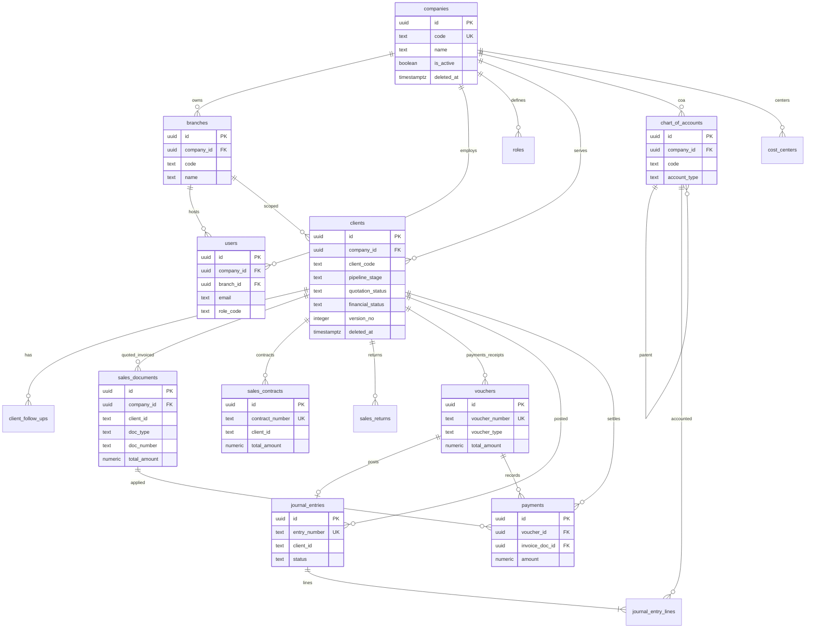
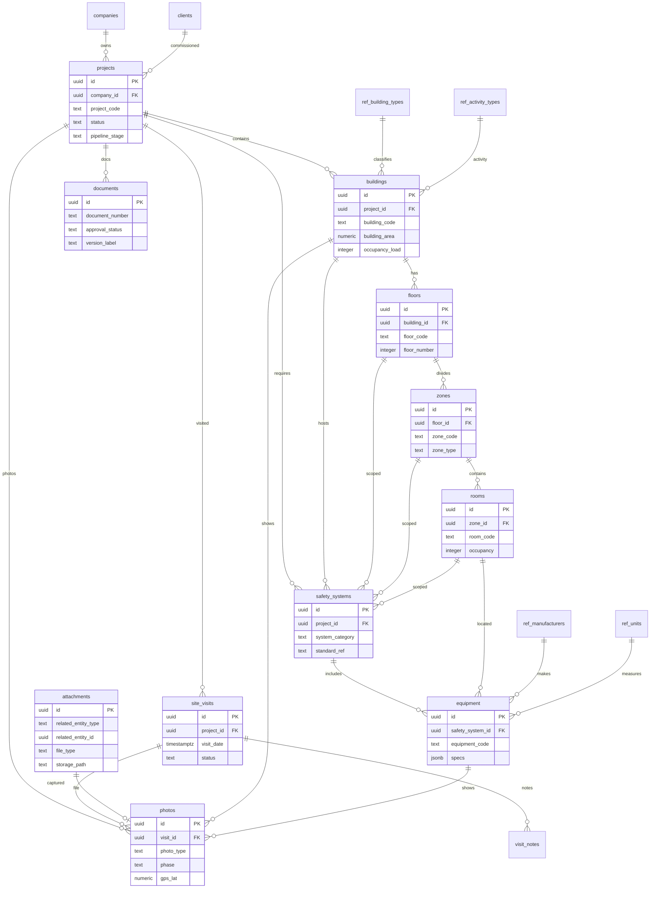
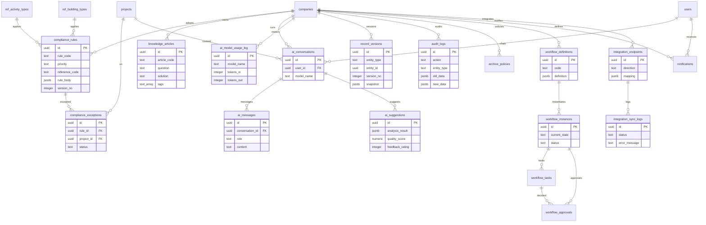

# مخططات العلاقات (ERD) — منصة توقع DDS v1.0

ثلاثة مخططات Mermaid تغطي المستأجر وCRM، وهيكل المشروع، والامتثال والذكاء الاصطناعي والتدقيق.

---

## 1) المستأجر + CRM / المبيعات / المحاسبة

---

## 2) هيكل المشروع والسلامة والوسائط

---

## 3) الامتثال + المعرفة + الذكاء الاصطناعي + التدقيق / Workflow

